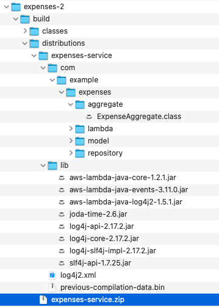

# Java AWS Lambda with Serverless.com Tutorial 

## Expense Service Tutorial - Iteration 2

Goal: Implement a basic AWS Lambda function that returns mocked expense data.

Steps:
1. [Create `serverless.yml`](#serverlessyml---setting-up-cloud-resources)
2. [Create out `build.gradle`](#maven-vs-gradle---building-the-java-deployment-artifact) or `pom.xml` (maven) file
3. [Implement a basic Lambda handler](#lambda-handlers-introduction)
4. [Deploy and run the Lambda function](#how-to-deploy-and-run-our-lambda)
5. [Implement Expenses Lamnbda handler](#expenses-lambda-handlers)
6. [Implement a simple way of testing lambda](#simple-testing-approach)

Also see the [Tips and Tricks](#tips--tricks) for additional info that might be handy in your adventure.

### Serverless.yml - setting up cloud resources
If you come across the name "The Serverless Framework" or you see a file `serverless.yml` being used in a project, then you must realise that the deployment tooling provided by [Serverless.com](https://serverless.com) is being used. This is just a technology that helps you to deploy your code and cloud resource configuration to a specific cloud provider (in our case AWS). There are other options as well:

* Use the AWS web console (please don't..)
* Use [AWS CDK (Cloud Development Kit)](https://aws.amazon.com/cdk/) (perhaps the topic of future tuts)
* Use [AWS SAM (Serverless Application Model)](https://aws.amazon.com/serverless/sam/)
* Use [AWS Cloudformation](https://aws.amazon.com/cloudformation/) directly (also not recommended)

[Serverless.com](https://serverless.com) provides easy to use tooling, with 3rd party plugins for extended functionality, that makes it very easy to setup various AWS resources, and get your code deployed as [AWS Lambda](https://aws.amazon.com/lambda/) functions.

It supports certain languages better than others, and unfortunately the getting-started templates for Java and Kotlin is quite outdated. 

The `serverless.yml` file is used by the Serverless framework to configure the necessary services on AWS, and know which code artifacts to upload and deploy as AWS Lambda functions.

* Refer to [serverless.yml](serverless.yml) for an example.

### Maven vs Gradle - building the Java deployment artifact
AWS Lambda support code from various programming languages. You can even compile a native binary and upload that as a custom container. 

For this tutorial, we deploy our code to AWS's lambda runtime for Java 11. In order to do this, we need to provide our compiles code, as well as any libraries (`.jar` files) that our code needs to run.

In order to implement AWS Lambda functions in Java, we need to include the following libraries as dependencies:

* `com.amazonaws:aws-lambda-java-core` - the core classes we need to implement a Lambda function in Java
* `com.amazonaws:aws-lambda-java-events` - a library containing various event classes that can be used to trigger functions,
* `com.amazonaws:aws-lambda-java-log4j2` - a library that makes it easier to log requests and responses from/to our lambda functions.

_Note: we do not need the *AWS SDK for Java V2* libraries yet when just implementing a Lambda function. We only need that when we make use of other AWS services from our lambda function code. We cover that in a next iteration._

_You can check for the latest versions at the [Maven Repository](https://mvnrepository.com). At the time of this README file update it was:
```
com.amazonaws:aws-lambda-java-core:1.2.1
com.amazonaws:aws-lambda-java-events:3.11.0
com.amazonaws:aws-lambda-java-log4j2:1.5.1
```

In our example we are using [Gradle](https://gradle.org) to manage dependencies, compile our code, and package the zip file that needs to be deployed.
The _gradle_ build creates [a zip file](#java-zip-file) that is referred to from the `serverless.yml` file, and uploaded to AWS as part of the deployment.

* Refer to the [build.gradle](build.gradle) file for an example.

_Note you can also use [Maven](https://maven.org) to build your Java code and package it in a zip file, as long as you end up with the content depicted in the [Java Zip File](#java-zip-file) section._

#### Java Zip file
Your `gradle` (or `mvn`) build must end up with a zip file that contains your compiled classes, as well as all libraries that you are dependent on (in a `libs` folder), as per the image below.


### Lambda Handlers Introduction
TODO: short intro to Lambdas
TODO: basic 'Hello World' handler 'HelloHandler'

### How to deploy and run our lambda
TODO: using sls to deploy
* Deploy:`sls deploy` (or `serverless deploy`)
* List deployed functions: `sls deploy list functions`
* Invoke function: `sls invoke -f expenses-service-development-hello`

### Expenses Lambda Handlers
TODO: handler to create Expense
TODO: something about events and mapping to Java POJOs approaches
TODO: handler to get all Expenses
TODO: if time, handler to find expense

### Simple testing approach
TODO: testing without local mocked services

## Tips & Tricks

### Logging basics
TODO: https://docs.aws.amazon.com/sdk-for-java/latest/developer-guide/logging-slf4j.html

### On Environments
TODO something on dev, vs staging, vs prod environments and how to manage it 

### Java Code examples TODO: move to later iteration
Various code examples exist for the various parts of the AWS SDK.
Refer to the [AWS Code Samples for Java (SDK V2)](https://docs.aws.amazon.com/code-samples/latest/catalog/code-catalog-javav2.html) doc.